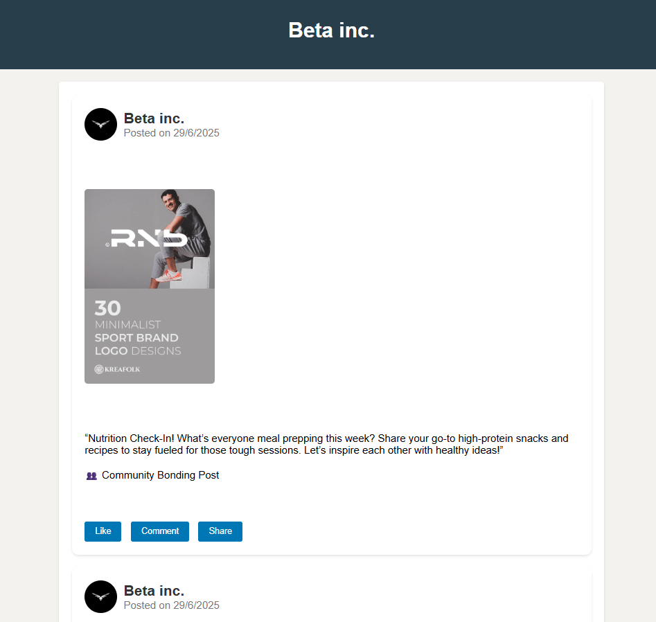

# 🏋️‍♂️ Fitness Community Website

A full-stack fitness community platform built with **Node.js, Express, MongoDB, and EJS** following the **MVC architecture**.
It allows coaches to create groups, users to join and interact in those groups, post content, and manage sessions securely.

---

## ✨ Features

### 🔐 Authentication & Sessions

* **Sign-up / Sign-in** with user details stored in MongoDB via Mongoose models.
* Sessions managed using **express-session**.
* User’s `_id` is stored in `req.session.userId` → reused across group creation, joining, and posting.
* Logout destroys session with `req.session.destroy()`.

### 👥 Communities & Groups

* Coaches can create groups with details and a logo image.
* Group data includes: `groupId`, `ownerId`, `members[]`, and other metadata.
* Users can subscribe to groups — their `req.session.userId` is added to `members[]`.
* Membership and ownership are tied directly to the login session.

### 📝 Posts & Content

* Owners can create posts (text + optional image).
* Posts are stored inside the `posts[]` array in MongoDB.
* Members can view posts, but only the **owner** can create/delete posts.

### 🗑️ Delete Functionality

* Implemented using **method-override** to allow DELETE requests in HTML forms.
* Owners can delete groups or posts securely.

### 📂 File Uploads & Image Rendering

* **Multer** handles uploads (logos, post images).
* Files are saved in `/uploads` folder.
* MongoDB stores only the file path (e.g., `uploads/169394930-logo.png`).
* Express serves `/uploads` as static files.
* EJS templates render images dynamically:

  ```html
  " alt="Post Image">
  ```

### 💳 Payment Page (Demo)

* A payment page displays subscription details (amount, duration, country, experience, description).
* Users can simulate joining a group by clicking **Pay**.

---

## 🛠️ Tech Stack

* **Backend:** Node.js, Express.js
* **Database:** MongoDB with Mongoose
* **View Engine:** EJS (Embedded JavaScript Templates)
* **Session Management:** express-session
* **File Uploads:** Multer
* **Form Methods:** method-override
* **Styling:** Static CSS served via Express

---

## 📐 Architecture

The project follows **MVC (Model–View–Controller)** pattern:

* **Models** → MongoDB schemas for `Gym` (users) and `Group` (communities + posts).
* **Views** → EJS templates (`login.ejs`, `create-group.ejs`, `group-home.ejs`, etc.) for rendering pages.
* **Controllers** → Business logic for authentication, group management, posting, subscriptions.
* **Routes** → Dedicated route files (`authRoutes.js`, `groupRoutes.js`) connect controllers to endpoints.

---

## 📂 Folder Structure

```
project-root/
├── controllers/       # authController.js, groupController.js
├── models/            # gym.js, group.js
├── routes/            # authRoutes.js, groupRoutes.js
├── views/connect/     # EJS templates (login, create, groups, posts, etc.)
├── uploads/           # Uploaded images (ignored in Git)
├── public/            # Static CSS/JS/images
├── index.js           # Entry point
└── package.json
```

## 📸 Screenshots

###  Communities Page


###  Posts


###  AI personal trainer


###  Calorie Counter

---

## 📜 License

MIT License © 2025 \[Ishan Nitin Salunkhe]

---
